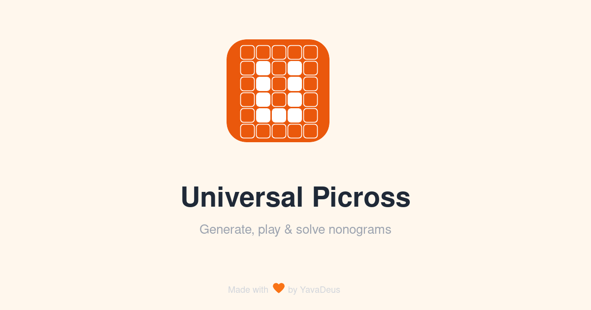

# Universal Picross

<p align="center">
  
</p>

A free, open-source **picross / nonogram** puzzle game that runs entirely in your browser. Generate random puzzles, import them from images or photos, and solve them manually or automatically.

Works on desktop and mobile. Installable as a PWA. Supports offline mode.

## Features

- **Generate** random puzzles (5x5 to 20x20, 3 difficulty levels)
- **Import** puzzles from an image file or camera photo (OCR-based recognition)
- **Play** with fill, mark, and erase modes (mouse, touch, drag support)
- **Auto-solve** any puzzle with the built-in constraint propagation + backtracking solver
- **Visual clue hints** — completed clues turn grey, impossible ones turn red
- **Victory animation** with confetti (or a friendly "Cheater!" if you used the solver)
- **5 languages** — French, English, German, Italian, Spanish
- **Offline mode** — optional OCR data preloading for fully offline image import
- **PWA** — installable on mobile and desktop, works without internet

## Tech Stack

| Tool | Role |
|---|---|
| React 19 + TypeScript | UI |
| Vite 8 | Build / dev server |
| Tailwind CSS v4 | Styling |
| Zustand | State management |
| Tesseract.js | OCR (lazy-loaded, ~15 MB) |
| vite-plugin-pwa | Service Worker + manifest |
| Vitest + Testing Library | Unit & component tests |
| Playwright | End-to-end tests |
| Prettier + ESLint | Code formatting & linting |

## Getting Started

```bash
# Install dependencies
make install

# Start dev server (http://localhost:5173)
make start

# Build for production
make build
```

## Commands

```bash
make install        # Install dependencies (--legacy-peer-deps)
make start          # Dev server
make build          # Production build
make test           # All tests
make test-unit      # Unit & component tests (Vitest)
make test-e2e       # End-to-end tests (Playwright)
make format         # Format code (Prettier)
make format-check   # Check formatting
make typecheck      # TypeScript type checking
make lint           # ESLint
make check          # build + lint + typecheck + test-unit
make clean          # Remove dist/ and node_modules/
```

## Project Structure

```
src/
  lib/            Pure logic (solver, generator, image processing, clue analysis)
  store/          Zustand stores (game, debug, settings)
  i18n/           Translations (fr, en, de, it, es) + i18n store
  hooks/          React hooks (useGame, useTimer, useCamera)
  components/     UI components by domain (game/, importer/, solver/, ui/)
  pages/          HomePage, GamePage, OptionsPage
tests/
  unit/           Logic & i18n tests
  component/      Component tests
  e2e/            Playwright end-to-end tests
```

## License

MIT

---

Made with 🧡 by [YavaDeus](https://github.com/JulienMattiussi/universal-picross)
